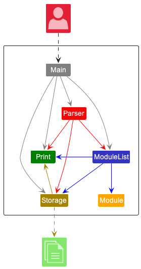
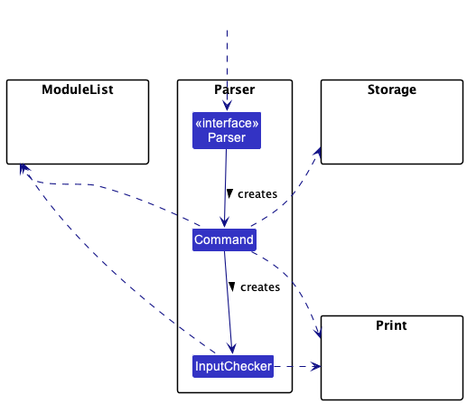
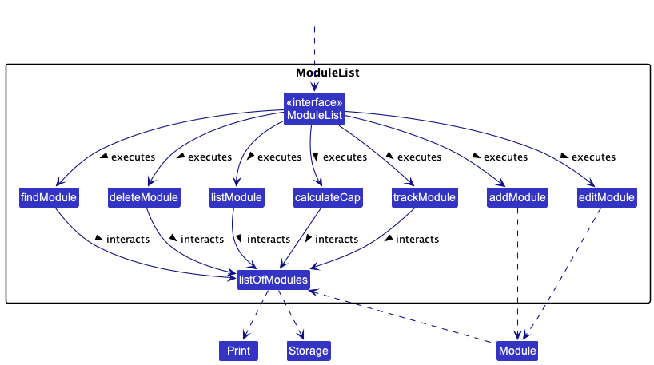
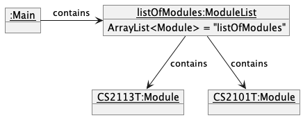

# Modganiser Developer Guide

## Introduction

---

Modganiser is **effortless module planning, at your fingertips via the Command Line Interface** (CLI). It helps Information security students graduate in time by giving you a platform to plan all 4 years of your modules to ensure that you meet graduation requirements (UE/GEs).  If you can type fast, Modganiser can get your schedule up  faster than traditional GUI apps.

## Table of Contents

---

[Introduction](#introduction)

[Table of contents](#table-of-contents) 
0. [Acknowledgements](#acknowledgements)
1. [Setting Up](#setting-up)
2. [Architecture](#architecture)
   + 2.1. [Storage](#1-storage-component)
   + 2.2. [Parser](#2-parser-component)
   + 2.3. [ModuleList](#3-modulelist-component)
   + 2.4. [Print](#4-print-component)
   + 2.5. [Module](#5-module-component)
3. [Design and Implementation](#3-design-and-implementation)
   + 3.1. [ManPage](#31-manpage)
   + 3.2. [Parser](#32-parser)
   + 3.3. [Add Modules](#33-add-modules)
   + 3.4. [Find Modules](#34-find-modules)
   + 3.5. [Delete Modules](#35-delete-modules)
   + 3.6. [Edit Modules](#36-edit-modules)
   + 3.7. [Add or Update Grade](#37-add-or-update-grade)
   + 3.8. [Calculate CAP](#38-calculate-cap)
4. [Appendix: Requirements](#appendix--requirements)
   + 4.1. [Product Scope](#product-scope)
   + 4.2. [Target User Profile](#target-user-profile)
   + 4.3. [User Stories](#user-stories)
   + 4.4. [Non-Functional Requirements](#non-functional-requirements)
   + 4.5. [Glossary](#glossary)
5. [Appendix: Instructions for manual testing](#appendix--instructions-for-manual-testing)

## Introduction 

## Acknowledgements

{list here sources of all reused/adapted ideas, code, documentation, and third-party libraries -- include links to the original source as well}

## Setting Up

## Architecture

---

The Diagram below shows an overview of how components are linked together to produce Modganiser.

Main components of the architecture
Modganiser has a class called `Duke`.

* It starts the app up at the beginning and passes the relevant inputs to the `Parser` to be parsed.
* It saves the name of the user for future uses.
* It ends the program when called to.

Modganiser consists of :

1. `Storage`
2. `Parser`
3. `ModuleList`
4. `Print`
5. `Module`

**How the components interact with each other**

When using the command `add /CS2113T /4 /CORE /1 /1` ,
The Sequence Diagram shows how the components interact with each other:

{image}

### 1. **Storage Component**

Firstly, the {explain workflow}

{uses}
*  It can save the name of the user into a file.
* The program can load data from the file when Modganiser starts up again.
* It can save changes to the file after each change such as an addition or deletion.
  This is done by using the methods

### 2. **Parser Component**
How the `Parser` component works:

* Firstly, when the `Parser` is called upon, it executes the `checkUserInput` method which parses the user input and 
calls the relevant methods according to the user input.
* According to the user input, it may execute some methods that are categorised as `checkValidInput` to check whether 
the input fields are valid
* The `Parser` interacts with the `Print` component to print error messages to the user if necessary.
* The `Parser` also interacts with the `Storage` component to save the updated list of modules after calling upon 
methods in the `ModuleList` component.
* If the user input is `list`, the `Parser` executes the `listModules` method, which interacts with relevant methods in 
the `ModuleList` component.
* If the user input is `edit`, the `Parser` executes the `editModuleInfo` method, which interacts with relevant methods 
in the `ModuleList` component.
* If the user input is `track`, the `Parser` executes the `trackGraduationRequirements` method, which interacts with 
relevant methods in the `ModuleList` component.
* For the remaining valid user inputs, the `Parser` will interact with the `ModuleList` component to execute relevant 
methods inside that component.

### 3. **ModuleList Component**

How the `ModuleList` component works:

* Firstly, when the `ModuleList` component is called, it will execute one of the following 7 types of methods.

* The 7 types of methods are:
1. `addModule`
2. `editModule`
3. `deleteModule`
4. `findModule`
5. `listModule`
6. `calculateCap`
7. `trackModule`

* The `listOfModules` is the ArrayList containing `Module` objects up to the current point of execution.

* For the first 2 methods, it will interact with the `Module` component. The result will then update the 
`listOfModules`.

* The remaining methods will interact with the `listOfModules` directly.

* `listOfModules` will then interact with the `Print` component to display the results of the executed command to the 
user.

* The `ModuleList` component will also interact with `Storage` component to save the updated `listofModules`.

### 4. **Print Component**

Firstly, the {explain workflow}

{uses}
*

### 5. **Module Component**

Firstly, the {explain workflow}

{uses}
*

## 3. Design and Implementation

---

### 3.1. ManPage 

The ManPage is a class that is used to display parts of the manual page that is requested by the user.
It has multiple methods for separate features.

**Implementation**

The sequence by which the ManPage class handles the `man` command is as follows:
1) The `Parser` class extracts the other fields of the user input, and calls upon the `checkUserInput()` method
   which calls upon the `checkManPageInput()`.

2) The method then uses the methods in the ManPage class to print out the requested feature.

`ManPage#printManPage()` - Prints the Command Summary.

`ManPage#printManPageAdd()` - Prints description of how to use the add feature.

`ManPage#printManPageList()` - Prints description of how to use the list feature.

`ManPage#printManPageEdit()` - Prints description of how to use the edit feature.

`ManPage#printManPageFind()` - Prints description of how to use the find feature.

`ManPage#printManPageDelete()` - Prints description of how to use the delete feature.

`ManPage#printManPageCalculator()` - Prints description of how to use the grade calculator.

`ManPage#printManPageUpdateGrade()` - Prints description of how to input grades.

`ManPage#printManPageExit()` - Prints description of how to use the exit feature.

**Design Considerations**

**Alternative 1** : Prints the manual page individually as features. 
Pros: Avoids wordy and long manual page when command is man, ability to have more description
for specific features. Avoids long methods. 
Cons: Extra step of typing another command to understand a feature well.

**Alternative 2**: Combining all feature descriptions in a single manual page. 
Pros: Avoid extra step of typing another command to understand a feature well.
Cons: Wordy and long manual page when command is man, user has to scroll through
a long manual page to find what they need. Long method.

### 3.2. Parser

The `Parser` is a class that handles the commands keyed in by the user.  
It has multiple checks to ensure that the user keys in valid commands. 

<!---elaborate more on the class, still unsure of the format...--->
<!---insert other commands here, still unsure of the format...(should it all be under Parser class or separate?)--->

### 3.3. Add Modules

`add` command:

The `add` command is used by the user to add a module or multiple modules at once.

The sequence by which the Parser class handles the `add` command is as follows:
1) The `Parser` class extracts the necessary fields from the user input, and calls upon the `addModule`
   method in the `ModuleList` class in a loop.
2) The method then checks the type of module that is being added, then calls the relevant
   constructor (`Core`, `UE`, `GE`, `Internship`).
3) The `addModule` method returns the module that is added to the `Parser` class.
4) The `getModuleListSize` method is called from `ModuleList` class.
5) The `printAddedModule` method is called from the `Print` class to display the result to the user.

The sequence of events above can be represented with the following sequence diagram:

<small><i>Figure ???</i></small>

### 3.4. Find Modules

The find modules features is facilitated by the `Parser`, `ModuleList` and `Module` Classes. `Parser` helps to check
for user input to determine is user doing a search via a module name or module type, which will then invoke the 
`findModuleByName` and `findModuleByType` methods respectively. If any modules are found, the ChatBot will print out
all the modules, else the ChatBot will return a message to the user, saying that no modules were found with the search
term they used.

Given below is an example usage scenario and how the findModuleByName mechanism behaves at each step.

Step 1: The user launches the application for the first time. The ChatBot will be initialised with an empty ArrayList
of Modules.

Step 2: The user executes `add /CS2113T CS2101 /4 /CORE /2 /2` to add two modules into the ChatBot via the addModules 
feature

The following object diagram shows the current state of the ChatBot:

<small><i>Figure ???</i></small>

Step 3: The user now wants to find the details of the modules he has just added. He executes `find /name /CS` which
will call `findModuleByName`. This method will then print out all the modules that have the keyword "CS" in their
module name.

The following sequence diagram shows how the `findModuleByName` operation works:

<small><i>Figure ???</i></small>

### 3.5. Delete Modules

`delete` command:

The `delete` command is used by the user to delete a module which is specified by the user.

The sequence in which the `Parser` class handles the `delete` command is as follows:
1) The `Parser` class extracts the necessary fields from the user input, and calls upon the `deleteModule`
   method in the `ModuleList` class.
2) The method then loops through the moduleList array, attempting to find a module with the module code
   that was specified by the user.
3) If a corresponding module is found, the `deleteModule` method will remove the module from the moduleList array
   and return the deleted `Module` object. Otherwise, the `deleteModule` method returns `null`.
4) If a deleted `Module` object is returned from `deleteModule`, the `Parser` class calls upon
   `printDeletedModule()` of the `Print` class. Otherwise, the `Parser` class calls upon `printNoDeletedModuleFound()`
   of the `Print` class. This displays to the user the result of the `delete` command.

<small><i>Figure ???</i></small>

### 3.6. Edit Modules

`edit` command:

The `edit` command is used by the user to make changes to fields in the module description.

The sequence in which the `Parser` class handles the `edit` command is as follows:
1) The `Parser` class extracts the other fields of the user input, and calls upon the `editModuleField()` method
   by self-invocation.
2) The method then uses a `switch` statement to evaluate the module field that the user wants to update.
3) After checking the field to be updated, the appropriate method within the `ModuleList` class is called upon to
   make the changes specified by the user.
4) If the user wants to update Modular Credits, the `editModularCredits()` method is called.
   This method directly modifies the `modularCredits` attribute of the `Module` object.
5) If the user wants to update Module Type, the `editModuleType()` method is called.
   This method removes the existing `Module` object and adds a new `Module` object of the new type specified
   by the user. The `getModuleCode()`, `getModularCredits()`, `getYear()`, `getSemester()` and `getGrade()`
   methods in the `Module` class are also called upon to obtain the respective fields required to create the new
   `Module` object.
6) If the user wants to update the Year, the `editYear()` method is called.
   This method directly modifies the `year` attribute of the `Module` object.
7) If the user wants to update the Semester, the `editSemester()` method is called.
   This method directly modifies the `semester` attribute of the `Module` object.

<small><i>Figure ???</i></small>

### 3.7. Add or Update Grade

`grade` command:

The `grade` command is used by the user to update the grade of modules that have already been completed.

The sequence by which the Parser class handles the `grade` command is as follows:
1) The `Parser` class extracts the other fields of the user input, and calls upon the `updateModuleGrade()` method
   in the `ModuleList` class.
2) The method then loops through the moduleList array to find the moduleCode that requires a grade update.
3) If the module is found, it calls the `Module` object method `setGrade()` to update the grade field
   and prints a success message by calling the `printUpdatedModuleGrade()` method of the `Print` class.
4) Else, it prints an error message by calling the `printInvalidModule()` method of the `Print` class.

The sequence of events above can be represented with the following sequence diagram:

<small><i>Figure ???</i></small>

### 3.8. Calculate CAP

`calculateCAP` command:

The `calculateCAP` command is used by the user to calculate the Cumulative Average Point (CAP) of graded modules.

The sequence by which the Parser class handles the `calculateCAP` command is as follows:
1) The `Parser` class extracts the other fields of the user input, and calls upon the `calculateCAP()` method
   in the `ModuleList` class.
2) The method then loops through the moduleList array to find modules that have been graded.
3) It checks if the module grade should be counted by self-invocation of the `shouldCountModule()` method
4) If it is, proceeds to obtain the grade value by self-invocation of the `getGradeValue()` method.
5) Calculates the required grade values, and finally calls the `printCalculatedCAP()` of the `Print` class to display
   the result to the user

The sequence of events above can be represented with the following sequence diagram:

<small><i>Figure ???</i></small>

## Documentation, logging and testing

* [Documentation guide](Documentation.md)
* [Testing guide](Testing.md)
* [Logging guide](Logging.md)

## Appendix: Requirements

###  Product Scope

---

### Target User Profile

Our target user profile is Information Security students in NUS.

### User Stories

| Version | As a...      | I want to...                                    | So that I can...                                                               |
|---------|--------------|-------------------------------------------------|--------------------------------------------------------------------------------|
| v1.0    | New user     | See usage instructions                          | Refer to them when I forget the commands                                       |
| v1.0    | New user     | See usage instructions based on feature         | Get more in depth knowledge on the feature that I require                      |
| v1.0    | New user     | Find a module by its code                       | Locate the module code without having to go through the entire list of modules |
| v2.0    | Current user | Find a module by its type                       | Locate all modules in a category without having to go through the entire list  |
| v1.0    | New user     | Add modules                                     | To plan out my 4 years in uni                                                  |
| v1.0    | New user     | Delete modules                                  | To edit my plan when necessary                                                 |
| v1.0    | New user     | View all my modules                             | Visualise my 4 year plan                                                       |
| v2.0    | Current user | View my modules by year                         | Focus better on one year rather than all 4 years                               |
| v1.0    | New user     | Categorise my modules by type                   | Ensure that all requirements are met                                           |
| v2.0    | Current user | Track the completion status of each module type | Ensure that all requirements are met                                           |
| v2.0    | Current user | Update the grade I got for a module             | Keep track of my grades                                                        |
| v2.0    | Current user | Calculate my CAP                                | Know my current CAP and project what honours I’ll graduate with                |
| v2.0    | Current user | Edit the details of current modules             | Change the details should I made a mistake or there was an update from NUS     |

### Non-Functional Requirements

1. Should work on any mainstream OS as long as it has Java 11 or above installed
2. Should be able to hold up to 1000 persons without a noticeable sluggishness in performance for typical usage.
3. A user with above average typing speed for regular English text (i.e. not code, not system admin commands) should be able to accomplish most of the tasks faster using commands than using the mouse.

### Glossary

Mainstream OS: Windows, Linux, Unix, OS-X, MacOS

## Appendix: Instructions for manual testing

### Launch and ShutDown

### Adding a module 

### Saving Data

