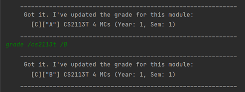
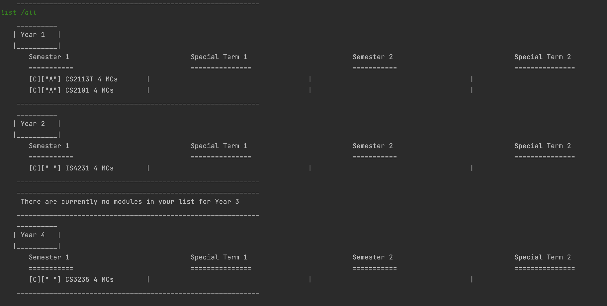
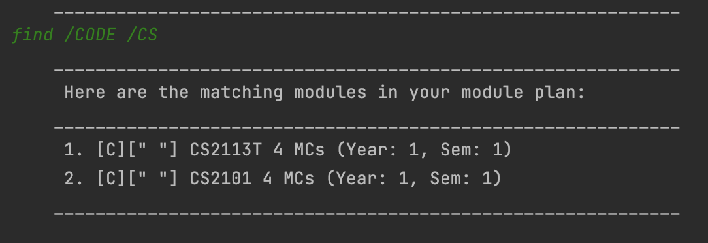
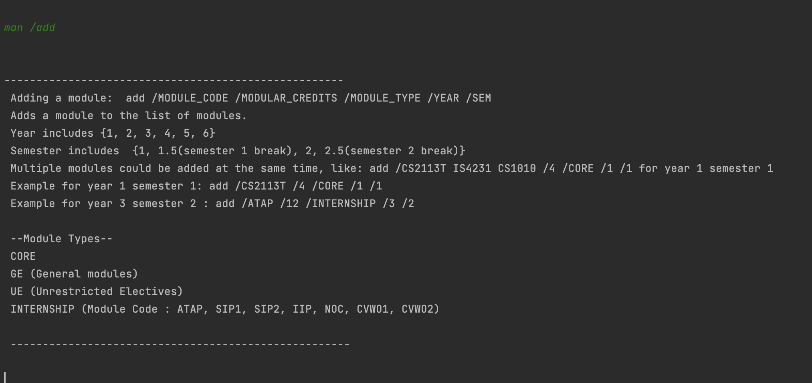

# Modganiser User Guide

## Table of Contents
--- ---
0. [Acknowledgements](#0-acknowledgements)
1. [Introduction](#1-introduction)
   + 1.1 [What Is Modganiser](#11-what-is-modganiser)
   + 1.2 [Who Is This User Guide Meant For?](#12-who-is-this-user-guide-meant-for)
   + 1.3 [How To Use This User Guide](#13-how-to-use-this-user-guide)
2. [Command Line Interface Tutorial](#2-command-line-interface-tutorial)
3. [Set Up Guide](#3-set-up-guide)
4. [Features](#4-features)
   + 4.1 [Notes On The Command Format](#41-notes-on-the-command-format)
   + 4.2 [Summary Of Features](#42-summary-of-features)
   + 4.3 [Managing Modules](#43-managing-modules)
     - 4.3.1 [Adding Modules: add](#431-adding-modules-add)
     - 4.3.2 [Adding Grade Obtained for Module: grade](#432-adding-grade-obtained-for-module-grade)
     - 4.3.3 [Editing Module Details: edit](#433-editing-module-details-edit)
     - 4.3.4 [Deleting Module From Module Plan: delete](#434-deleting-module-from-module-plan-delete)
   + 4.4 [Managing Display of Module Plan](#44-managing-display-of-module-plan)
     - 4.4.1 [Viewing Module Plan: list](#441-viewing-module-plan-list)
     - 4.4.2 [Finding Modules In The Module Plan: find](#442-finding-modules-in-the-module-plan-find)
   + 4.5 [Tracking Graduation Progress](#45-tracking-graduation-progress)
     - 4.5.1 [Tracking the Completion of Each Module Type: track](#451-tracking-the-completion-of-each-module-type-track)
     - 4.5.2 [Calculating Your Current CAP: calculatecap](#452-calculating-your-current-cap-calculatecap)
   + 4.6 [Miscellaneous](#46-miscellaneous)
     - 4.6.1 [Viewing the Entire Manual: man](#461-viewing-the-entire-manual-man)
     - 4.6.2 [Viewing the Detailed Manual Page for A Single Feature: man /FEATURE](#462-viewing-the-detailed-manual-page-for-a-single-feature-man-feature)
     - 4.6.3 [Exiting Modganiser: bye](#463-exiting-modganiser-bye)
     - 4.6.4 [Saving Module Plan](#464-saving-module-plan)
5. [FAQ](#5-faq)
6. [Command Summary](#6-command-summary)
7. [Glossary](#7-glossary)

<p align="right">Return to Top</p>

<div style="page-break-after: always;"></div>

## 0. Acknowledgements
--- ---
We would like to thank you for choosing Modganiser to help you with your module planning. 
Modganiser will be sure to make this arduous task a breeze while ensuring you meet all your graduation requirements, 
so that you can focus on the other aspects of university that really matter. 
Should you have any feedback or enquiries, please do not hesitate to reach out to us!

## 1. Introduction
--- ---
### 1.1 What is Modganiser?
Modganiser is effortless module planning, at your fingertips via the Command Line Interface (CLI), 
focused on helping Information Security Undergraduates graduate in 4 years. It does so by giving you a platform to 
plan all 4 years of your modules to ensure that you meet the graduation requirements (Core/UE/GE/Internships). 
If you can type fast, Modganiser can get your schedule up faster than traditional GUI apps.

### 1.2 Who Is This User Guide Meant For?
Are you a current information security undergraduate at NUS? Or are you a prospective student, 
about to begin your journey into information security? Well, Modganiser is exactly what you are looking for! 
This user guide will help you as you navigate through Modganiser and its features. If you are a new user, do go to the 
set-up section to learn how to install and run Modganiser. To learn more about Modganiser’s features, do head over to 
the features section!

### 1.3 How To Use This User Guide
Modganiser uses a Command Line Interface (CLI) which may be new to some users. We strongly recommend that you read this 
User Guide from start to finish if you are new to Modganiser, although you may choose to skip to more relevant sections 
if you are used to Java, CLI or Modganiser, which are described below:
* Refer to our Table of Contents to navigate between the different sections
* Refer to our Command Line Interface (CLI) tutorial to learn how to use CLI
* Refer to our Set Up Guide to learn how to install Modganiser
* Refer to our Features to learn more about Modganiser’s functions
* Refer to our FAQ for answers to frequently ask questions
* Refer to our Command Summary to get an overview of the different commands available in Modganiser and their formats
* Refer to our Glossary to learn more about the key terms in this

## 2. Command Line Interface Tutorial
--- ---
To open up the Command Line Interface (CLI)
* For Windows
  * Click on the Windows button and search for “Command Prompt”.
* For MacOS
  * Press on the command and spacebar button together and search for “Terminal”
* The window that comes up is the CLI on your computer. We will be using this interface to run Modganiser.
* To run commands in the CLI, just type the command out, press enter and the command will run


<small><i>Figure 1: Windows version of CLI with a command typed out</i></small>


<small><i>Figure 2: MacOS version of CLI with a command typed out</i></small>


## 3. Set Up Guide
--- ---
To set up Modganiser, please follow the steps below:
1. Download Java
   * For Windows:
     * Please click [here](https://www.oracle.com/java/technologies/downloads/#jdk20-windows) for the Java Developer Webpage and choose the x64 installer.
   * For Mac
     * Please click [here](https://www.oracle.com/java/technologies/downloads/#jdk20-mac) for the Java Developer Webpage and choose the Arm 64 DMG Installer.
2. Please click [here](https://github.com/AY2223S2-CS2113T-T09-4/tp/releases) and download the tp.jar file, which contains Modganiser.
3. Save the file into a new folder on your Desktop and title the folder “Modganiser”
4. Open the CLI interface on your device. If you are unsure of how to do so, please refer to our CLI tutorial.
   * Type “cd Desktop” and press enter
   * Type “cd Modganiser” and press enter
   * Type “java -jar tp.jar” and press enter
5. If successful, you should see the following displayed on your screen:


<small><i>Figure 3: Modganiser Successful Start Up</i></small>
6. Type your name in and press enter. If successful, you should see the following:


<small><i>Figure 4: Enter Name Successful</i></small>
7. Modganiser is now ready to run. You can type commands at the bottom after the horizontal line

## 4. Features
--- ---
Before we begin with the features, here are some special notations that we will be using. Please familiarize yourself with these notations as it will enhance your experience with the user guide.

**Tips**

Tips are useful suggestions that will help you have a better experience with Modganiser

```diff
💡 Tip: Tips are useful
```
**Notes**

Notes are important information that you should pay attention to when using Modganiser
```diff
📓 Note: Notes are important, take them down
```

**Warnings**

Warnings are to warn you of potential pitfalls that new users may encounter. For example: commands like delete /MODULE_CODE  deletes the module from your plan and the action is irreversible.
```diff
❗ Warning: Read this section carefully when you see it
```

### 4.1 Notes on the Command Format
```diff
📓 Note: 
1. Command Words
  - Command words are not case-sensitive
    Eg. BYE will be accepted as the bye command
2. Parameters
  - Words in UPPER_CASE refers to the inputs from the user
  - All inputs for the command parameters should come with a slash “/” before it to indicate that it is a user input and not a Command Word.
  - Inputs from you are not case-sensitive. All inputs will be converted to uppercase before they are executed. Therefore, parameters like /cs2113t will be treated as /CS2113T by default
    Eg. find /CODE /Cs2113t will be treated as FIND /CODE /CS2113T by Modganiser
  - You should provide as many inputs as there are parameter fields for the command. Missing or Additional Inputs will trigger an error by Modganiser
3. Markdown Texts
  - Markdown texts are texts that look like this, which indicates that this is a command and the parameters that the user can input.
4. Errors and Warnings
  - If you are receiving an error or warning, do check that you do not have missing or additional inputs and that your inputs are in the list of accepted input
```

<small><i>Figure 5: Missing Inputs to Parameters</i></small>

<small><i>Figure 6: Additional Inputs to Parameters</i></small>

### 4.2 Summary Of Features
Below is a summary of features that Modganiser has. Type the corresponding command in the Command Line Interface and press Enter to execute it.
* Adding a module:  `add /MODULE_CODE /MODULAR_CREDITS /MODULE_TYPE /YEAR /SEM`
* Input grade for module: `grade /MODULE_CODE /GRADE`
* Editing a module: `edit /MODULE_CODE /FIELD_TO_EDIT /NEW_INFO`
* Listing modules by year : `list /YEAR`
* Locating module by code or type : `find /TYPE_OF_SEARCH /KEYWORD`
* Track Module Type Completion: `track /MODULE_TYPE`
* Grade Calculator: `calculatecap`
* Viewing manual: `man`
* Viewing a specific manual for a feature: m`an /FEATURE`
* Exiting the program : `bye`

### 4.3 Managing Modules

#### 4.3.1 Adding Modules: `add`


### Add command: `add`

The add command is used to add a module to the module tracker. It is case and space insensitive.

Command: `add /{Module Code} /{Modular Credits} /{Module Type} /{Year} /{Semester}`

Accepted Inputs:

Module Code: Cannot be empty, must be 6 or more characters.

Modular Credits: [0-6, 8, 12]

Module Types: [Core, GE, UE, Internship] referring to Core, General Electives, Unrestricted Electives and Internships.

Year: [0-6]

Semester: [1, 1.5, 2, 2.5] referring to Semester 1, Semester 1 break (Special Term I),
Semester 2, Semester 2 break (Special Term II)

Example Input: `add /CS2113T /4 /CORE /2 /2`

Expected Output:
```    
    ____________________________________________________________
     Got it. I've added this module:
       [C][" "] CS2113T 4 MCs (Year: 2, Sem: 2)
     Now you have 1 modules in the list.
    ____________________________________________________________
```

#### 4.3.2 Adding Grade Obtained for Module: `grade`


### Grade command: `grade`

The `grade` command can be used to input a valid grade when the user has completed a module.  
The `grade` command can also be used to update the grade for a module.

Command: `grade /MODULE_CODE /GRADE`

Example: `grade /CS2113T /A`

Expected Output:

  

<small><i>Figure ???</i></small>

Example: `grade /CS2113T /B` after previous command

Expected Output:

  

<small><i>Figure ???</i></small>

#### 4.3.3 Editing Module Details: `edit`

### Edit command: `edit`

The `edit` command edits the information in a specified field of an existing module.
The field to edit can be `CODE`, `MC`, `TYPE`, `YEAR`, `SEMESTER` or `GRADE`.

Command: `edit /MODULE_CODE /FIELD_TO_EDIT /NEW_INFO`

Example: `edit /CS2113T /TYPE /UE`

Expected Output: 


<small><i>Figure ???</i></small>

Example: `edit /CS2113T /MC /8`

Expected Output:


<small><i>Figure ???</i></small>

#### 4.3.4 Deleting Module From Module Plan: `delete`

### Delete command: `delete`

The `delete` command deletes an existing module that corresponds to the module code inputted.  

Command: `delete /MODULE_CODE`

Example: `delete /CS2113T`

Expected Output:


<small><i>Figure ???</i></small>

```diff
❗ Warning: Trying to delete a module that is not present will cause Modganiser to throw an error.
```

### 4.4 Managing Display of Module Plan


#### 4.4.1 Viewing Module Plan: `list`

### List command: `list`

The `list` command allows you to view your 4-year module plan, separated by year.
The `list` command also allows you to choose to only view a specific year in your module plan.
The accepted inputs for the `YEAR` field are `all`, `1`, `2`, `3` and `4`.

Command: `list /YEAR`

Example: `list /all`



<small><i>Figure ???</i></small>

Example: `list /1`


<small><i>Figure ???</i></small>

#### 4.4.2 Finding Modules in the Module Plan: `find`
**Function**

Searches for the module whose module code contains the keyword inputted by the user, or the modules whose module type is the module type inputted by the user.

|   Parameter    |                          Description                           |                                                                Accepted Inputs                                                                |
|:--------------:|:--------------------------------------------------------------:|:---------------------------------------------------------------------------------------------------------------------------------------------:|
| TYPE_OF_SEARCH |    Specifies to search using the module code or module type    |                                                                  CODE, TYPE                                                                   |
|    KEYWORD     |                   The keyword to search for                    | If TYPE_OF_SEARCH is CODE, all inputs will be accepted. However, if TYPE_OF_SEARCH is TYPE, only CORE, GE, UE and INTERNSHIP will be accepted |

**Command Format**

`find /TYPE_OF_SEARCH /KEYWORD`

Example: find /TYPE /CORE finds all modules that contains CS2113T


<small><i>Figure 18: Finding a module with its full module code</i></small>

Example: `find /CODE /CS` finds all modules whose module code contains the keyword “CS”



<small><i>Figure 19: Finding a module by substring of name</i></small>

Example: find /TYPE /CORE Find all modules whose module type is Core


<small><i>Figure 20: Finding a module by type</i></small>


### 4.5 Tracking Graduation Progress
#### 4.5.1 Tracking the Completion of Each Module Type: `track`
**Function**
Tracks how many modular credits of a module type you have completed and Modganiser will list out all the modules that you have completed under that module type and how many more modular credits you need before you meet the requirements for that module type.

|  Parameter  |                   Description                    |        Accepted Inputs        |
|:-----------:|:------------------------------------------------:|:-----------------------------:|
| MODULE_TYPE | The module type whose status you want to look up | ALL, CORE, GE, UE, INTERNSHIP |

**Command Format**
`track /MODULE_TYPE`
Example: `track/CORE` tracks the completion status of your core modules.


<small><i>Figure 21: Tracking Module Type Completion Status</i></small>

```diff
📓 Note: Completed modules are modules which have a grade. Modules which do not have a grade will not be considered as completed and hence not counted.
```

### 4.5.2 Calculating Your Current CAP: `calculatecap`


### CalculateCAP command: `calculatecap`

The `calculatecap` command can be used to calculate your Cumulative Average Point (CAP) across completed modules
based on grade values that you obtained.  
The result would be rounded off to 2 decimal places for the user.
+ Grades obtained correspond to a number that is used to calculate your cap. To find out more, do visit the
  official [NUS website](https://www.nus.edu.sg/registrar/academic-information-policies/modular-system) :)

Command: `calculatecap`

Example: `calculatecap`

Expected Output:

 

<small><i>Figure ???</i></small>

--- ---
<div style="page-break-after: always;"></div>

### 4.6 Miscellaneous
#### 4.6.1 Viewing the Entire Manual: `man`

**Function**

Shows a summary of all the available commands

| Parameter | Description | Accepted Inputs |
|:---------:|:-----------:|:---------------:|
|    NIL    |     NIL     |       NIL       |


**Command format** 

`man`

Example : `man` Displays the manual page

Expected Output:


<small><i>Figure 23: Displaying part of entire manual</i></small>


#### 4.6.2 Viewing the Detailed Manual Page for A Single Feature: `man /FEATURE`

**Function**

Shows a detailed instruction page for the specific command requested

| Parameter |                    Description                     |                    Accepted Inputs                    |
|:---------:|:--------------------------------------------------:|:-----------------------------------------------------:|
|  FEATURE  | The command that you would like to know more about | add, list, edit, find, delete, calculator, grade, bye |

**Command format**

`man /FEATURE`

Example: `man /add` Displays the manual page for the add feature



<small><i>Figure 24: Displaying manual of specific feature</i></small>


#### 4.6.3 Exiting Modganiser: `bye`
**Function**

Exits Modganiser

**Command Format**

`bye`
Example: `bye` exits the program

<small><i>Figure 25: Modganiser Exits</i></small>

```diff
📓 Note: 
Typing bye during any time when the Modganiser is running will exit the program. When Modganiser asks for your name during its first start up, typing bye will also exit the program. If your name is “bye”, please do consider using an alias. Thank you and sorry for the inconvenience caused.
```

#### 4.6.4 Saving Module Plan

Modganiser automatically saves your module plan into your local storage onto your device after every command you input

To find your save file:
1. Go to your Desktop and find the folder titled “Modganiser” or find the folder where tp.jar is saved.
2. Double click on the folder and find the folder titled “data”
3. Double click on the folder and the file titled “modules.txt” is the save file

```diff
❗ Warning: Please do not edit this save file to prevent corrupting your saved data.
```
Your saved module plan will be automatically loaded when you run Modganiser.
```diff
📓 Note: If you switch device, and want to import your module plan from your old device to the new one, firstly locate your save file on the old device, which is just a normal text file. You can then use any form of messaging applications like telegram, email applications like gmail or online cloud storage like google drive to send this save file to yourself or store this save file. You can then retrieve this save file from your new device.
```


## 5. FAQ
--- ---

| Questions                                                                                                                     | Answers                                                                                                                                                                                                                                                                                                                                                                                                      |
|-------------------------------------------------------------------------------------------------------------------------------|--------------------------------------------------------------------------------------------------------------------------------------------------------------------------------------------------------------------------------------------------------------------------------------------------------------------------------------------------------------------------------------------------------------|
| I am unable to install java?                                                                                                  | Please click here to install the correct version of java for your device (Windows or MacOS) or contact the developers for help.                                                                                                                                                                                                                                                                              |
| Why is Modganiser not running?                                                                                                | Please follow our Command Line Interface Tutorial and our Set Up Guide closely. If Modganiser still fails to run, please contact us at this email.                                                                                                                                                                                                                                                           |
| Where is my save file?                                                                                                        | Please go to your desktop and locate the folder titled “Modganiser” or the folder where you stored tp.jar. Inside that folder, you will find another folder titled “data” which has a text file titled “modules”. This text file is the save file which has information on your module plan.                                                                                                                 |
| What if I change my device? How do I bring the save data to my new device                                                     | You can locate your save file, which is just a normal text file. You can then use any form of messaging applications like Telegram, email applications like Gmail or online cloud storage like Google Drive to send this save file to yourself or store this save file. You can then retrieve this save file with your new device.                                                                           |
| Why am I able to add CS0000 even though it is not a valid module?                                                             | We are unable to keep a database of modules in our ChatBot and hence cannot check if the module code you inputted is being offered. Please go onto NUSMods to check the modules you want to take before carefully inputting the module code and the number of MCs of that module. Furthermore, please double check against the Information Security Student requirements before deciding on the module type. |
| Why is it that when the Modganiser ask for my name and I type bye, the Modganiser will quit instead of saving my name as bye? | `bye` is a command that will quit Modganiser, regardless of where it is used. If your name is “bye”, please consider using an alias. We are very sorry for the inconvenience caused.                                                                                                                                                                                                                         |

## 6. Command Summary

|             Feature             |                           Format                            |                                   Example                                    |
|:-------------------------------:|:-----------------------------------------------------------:|:----------------------------------------------------------------------------:|
|           Add modules           | `add /MODULE_CODE /MODULAR_CREDITS /MODULE_TYPE /YEAR /SEM` | `add /CS2113T /4 /CORE /1 /1` or `add /CS2113T CS2101 IS4231 /4 /CORE /1 /1` |
|       Add grade obtained        |                 `grade /MODULE_CODE /GRADE`                 |                             `grade /CS2113T /A+`                             |
| Edit details of existing module |       `edit /MODULE_CODE /FIELD_TO_EDIT /NEW_INFO  `        |                          `edit /CS2113T /TYPE /UE`                           |
|     Delete existing module      |                    `delete /MODULE_CODE`                    |                              `delete /CS2113T`                               |
|        List module plan         |                        `list /YEAR`                         |                                  `list /2`                                   |
|   Find module in module plan    |               `find /TYPE_OF_SEARCH /KEYWORD`               |                      `find /CODE /CS or find /TYPE /GE`                      |
|  Track progress of module type  |                    `track /MODULE_TYPE`                     |                             `track /INTERNSHIP`                              |
|      Calculate current CAP      |                       `calculatecap`                        |                                `calculatecap`                                |
|        View Manual Page         |                   `man` or `man /FEATURE`                   |                             `man` or `man /add`                              |
|         Exit Modganiser         |                            `bye`                            |                                    `bye`                                     |

## 7. Glossary

| Technical Term         | Explanation                                                                                                                   |
|------------------------|-------------------------------------------------------------------------------------------------------------------------------|
| Command Line Interface | Text based user interface to run programs                                                                                     |
| Parameter              | Additional input fields that require user inputs for the command word                                                         |
| Core Module Type       | Any module that does not fall under UE, GE or Internship module type                                                          |
| GE Module Type         | Stands for General Elective Module Type. Please refer to the NUS Website for more information on the General Elective Modules |
| UE Module Type         | Stands for Unrestricted Elective Module Type. Please refer to the NUS Website for more information on the UE Module           |
| Internship Module Type | Please refer to the NUS Website for more information on Internships                                                           |
| Local storage          | Data that is stored on your device and can be accessed without an internet connection                                         |


