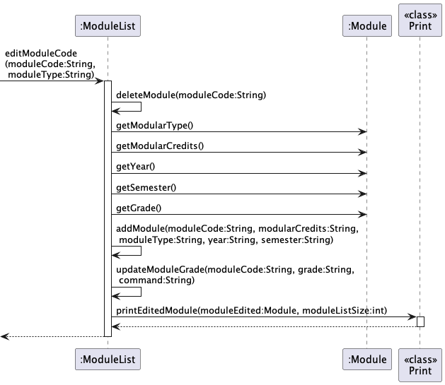
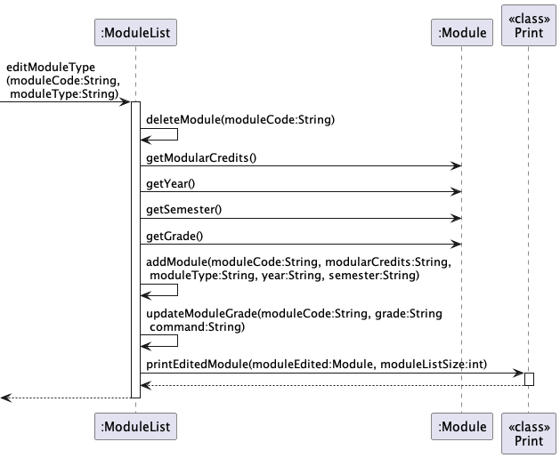

# Goh Chok Yao - Project Portfolio Page

## Project: Modganiser

Modganiser provides effortless module planning at your fingertips via the Command Line Interface (CLI), focused on helping
Information Security Undergraduates graduate in 4 years. It allows you to plan all 4 years of your modules
to ensure that you meet your graduation requirements.

## Summary of contributions

### Code Contributed
* [This link to my RepoSense report](https://nus-cs2113-ay2223s2.github.io/tp-dashboard/?search=chokyao&breakdown=true&sort=groupTitle%20dsc&sortWithin=title&since=2023-02-17&timeframe=commit&mergegroup=&groupSelect=groupByRepos&checkedFileTypes=docs~functional-code~test-code~other) shows my code contributions to the project.

### Enhancements Implemented
* Implemented the Delete Module Feature: **PR** [#30](https://github.com/AY2223S2-CS2113T-T09-4/tp/pull/30)
  * Added the `deleteModule()` method in `ModuleList` class to enable deletion of modules from the plan

* Contributed to the Edit Module Feature: **PR** [#151](https://github.com/AY2223S2-CS2113T-T09-4/tp/pull/151)
  * Handled the sections on editing grade, module type and module code in `ModuleList` class

* Implemented the Save User's Name Feature: **PR** [#127](https://github.com/AY2223S2-CS2113T-T09-4/tp/pull/127)
  * Handled prompting and saving of user's name on user's first time starting up of the application 
  and added the ability to retrieve saved name on subsequent start-ups.

* Implemented the Save Modules Feature: **PR** [#81](https://github.com/AY2223S2-CS2113T-T09-4/tp/pull/81)
  * Added the ability to save modules and constantly update the save file as the user makes changes to 
  his/her plans.

* JUnit Testing, Assertions, Logging: **PR** [#52](https://github.com/AY2223S2-CS2113T-T09-4/tp/pull/52), **PR** [#62](https://github.com/AY2223S2-CS2113T-T09-4/tp/pull/62) 
  * Added Junit Testing and assertions for the `delete` command.
  * Added logging to `delete` and `save` commands.

* PE-D Bugs: **PR** [#253](https://github.com/AY2223S2-CS2113T-T09-4/tp/pull/253)
  * Squashed PE-D bugs related to corruption of save file where a corrupted save file will result in inability to start the application:

### User Guide
* Added first draft of the section on delete modules feature: **PR** [#161](https://github.com/AY2223S2-CS2113T-T09-4/tp/pull/161)
  

### Developer Guide
* Added sections on Storage and Print components: **PR** [#233](https://github.com/AY2223S2-CS2113T-T09-4/tp/pull/233)
* Added section on delete module: **PR** [#117](https://github.com/AY2223S2-CS2113T-T09-4/tp/pull/117), **PR** [#277](https://github.com/AY2223S2-CS2113T-T09-4/tp/pull/277)
* Edited the section on the edit modules command: **PR** [#171](https://github.com/AY2223S2-CS2113T-T09-4/tp/pull/171)
* Added the sequence diagram for `delete` command, `track` command, `editModuleCode()` and `editModuleType()`: **PR** [#233](https://github.com/AY2223S2-CS2113T-T09-4/tp/pull/233), **PR** [#283](https://github.com/AY2223S2-CS2113T-T09-4/tp/pull/283), **PR** [#314](https://github.com/AY2223S2-CS2113T-T09-4/tp/pull/314) 
* Added both Appendices sections (Requirements and Instructions for Manual Testing): **PR** [#233](https://github.com/AY2223S2-CS2113T-T09-4/tp/pull/233)
  * Product Scope, User Stories, Use Cases and Non-Functional Requirements
* Edited the format of the DG to make it standardised and neat: **PR** [#314](https://github.com/AY2223S2-CS2113T-T09-4/tp/pull/314)

### Team-based Tasks
* Released jar file for v2.0

### Reviewing / Mentoring
* Reviewing PRs: **PR** [#93](https://github.com/AY2223S2-CS2113T-T09-4/tp/pull/93), **PR** [#114](https://github.com/AY2223S2-CS2113T-T09-4/tp/pull/114), **PR** [#256](https://github.com/AY2223S2-CS2113T-T09-4/tp/pull/256)

### Contributions beyond the project team
* Found and reported [PE-D bugs](https://github.com/chokyao/ped/issues) for team [Inka](https://github.com/AY2223S2-CS2113-F10-1/tp)
* Reviewed other UGs and DGs of other groups

### Extract: Developer Guide

#### Sequence Diagrams

#### Portion on Delete Modules

`delete` command:

The `delete` command is used by the user to delete a module which is specified by the user.

The sequence in which the `Command` class handles the `delete` command is as follows:
1. The `Command` class extracts the necessary fields from the user input, and calls upon the `deleteModule()`
   method in the `ModuleList` class.
2. The method then loops through the `listOfModules` array in the `ModuleList` object, attempting to find a module
   with the module code that was specified by the user.
3. If a corresponding module is found, the `deleteModule()` method will remove the module from the `listOfModules` array
   and return the deleted `Module` object. Otherwise, the `deleteModule()` method returns `null`.
4. If a deleted `Module` object is returned from `deleteModule()`, the `Command` class calls upon
   `printDeletedModule()` of the `Print` class. Otherwise, the `Command` class calls upon `printNoDeletedModuleFound()`
   of the `Print` class. This displays to the user the result of the `delete` command.

The following sequence diagram shows how the `deleteCommand()` operation works:

